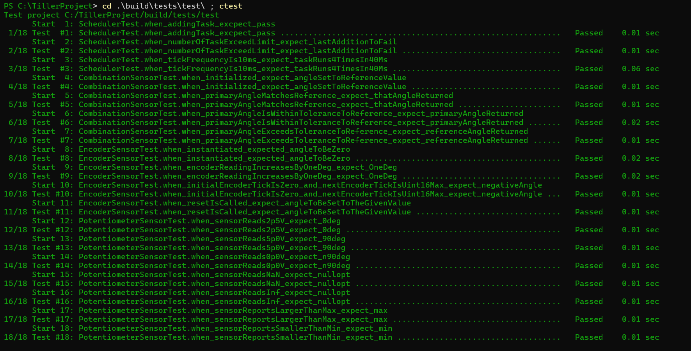

## Description
Project implements a combined sensor that reads the tiller angle from a relative encoder and an absolute potentiometer. The relative encoder has the issue of slipping / dropping encoder ticks occassionally. When enough ticks have been dropped and the angle estimation drifts far enough from the potentiometer's estimation, then the combined sensor class fixes it. The combined sensor class fixes the estimation by resetting the encoder sensor with the current reading from the potentiometer. The sensor reading is then collected at a regular rate from time-triggered task and the task prints the value to COUT. The scheduler for the time-triggered architecture runs in one thread. This thread retrieves the tiller angles from two dummy classes that mock an encoder driver and an adc driver. Those two objects are shared with the other thread that supplies them with the tiller angle.

The other thread calculates the next tiller angle and then updates both the dummy encoder driver and dummy adc driver. To avoid both threads using the dummy objects at the same time, they share a mutex that they need to lock in order to either update or read the dummy classes.

## Installation
To build and run the simulation and the tests, you'll need download the following packages and assign them to the PATH
- Python (https://www.python.org/downloads/)
- cmake (https://cmake.org/download/)
- A C / C++ compiler (For Windows: https://www.mingw-w64.org/downloads/#w64devkit)

## How To Run Unit Tests
**_NOTE:_** The compiled build folder was included in the zip file, if you just want to run the output skip to step 4
1. Open a terminal and navigate to the root of the project `/TillerProject`
2. Run: `cmake --preset tests`
3. Run: `cmake --build --preset tests`
4. Run: `cd .\build\tests\test\ ; ctest`

The output will look like the following:

The testing output shows each of the following with a pair of lines
- The cardinal number denoting the order in which the tests were run
  - Proper unit testing shouldn't have dependency test to test, but this is how you can keep track of if there is a dependency issue.
- Which suite the test is from and the name of the test for identification
  - Note the naming scheme shows conditions the unit test is creaitng and the expected output without neeidng to open the code
- The result of the unit test
- The execution duration of the test 
  - This is handy to tell what conditions or functions are hogging resources

## How To Run Simulation
**_NOTE:_** The compiled build folder was included in the zip file, if you just want to run the output skip to step 4 of `To Build And Launch The Simulation`
### To Configure The Simulation
All of the project parameters are stored in `include/params/tiller_params.hpp`. 
#### Key Params To Consider Messing With
- `kTickPeriodMs`: Controls how often the tiller angle sensor runs (ie. How often the system prints to the terminal)
- `kEncoderTicksPerDegree`: Controls the resolution of the encoder sensor
- `kSmallestAngleChange`: Controls the smallest angle change for each angle update
- All of the odds are. These control the odds for the tiller direction to change and the odds for the encoder to drop ticks / slip
- 
### To Build and Launch The Simulation
1. Navigate to the project root `/TillerProject`
2. Run: `cmake --preset simulation`
3. Run: `cmake --build --preset simulation`
4. Run: `cd .\build\bin\simulation\ ; ./simulation.exe`
5. Kill The Simulation With: `^C`
